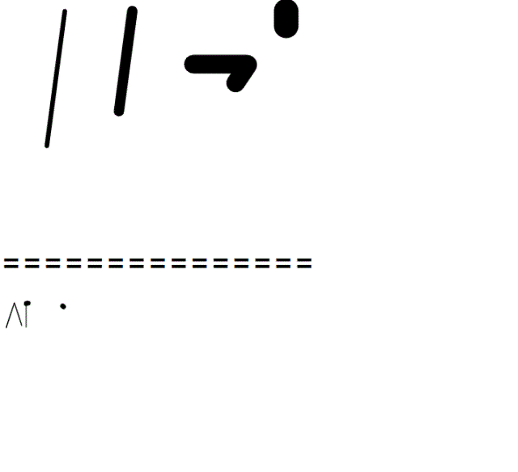

# svg-font

svg-font is a living font that can be used in web pages.

<p align="center">
  
</p>

## How to use
1. Install this repositories.
2. Add ./svgFont directory in your project.
3. Add following codes in HTML file.

```html
<script type="text/javascript" src="./svgFont/svgFontData.js"></script>
<script src="./svgFont/svgFont.js"></script>
<svg id="svgFont" xmlns="http://www.w3.org/2000/svg"></svg>

<script src="example.js"></script>
```

```javascript
// example.js

const font = new svgFont('svgFont',"ChaeJin BaBu ^^7",
            {size:1, spacing:20, lineHeight:50, strokeWidth:20, animation:"example1"});
```

4. Add the animation style.

e.g.

```css
@keyframes example1 {
    0% {
        stroke-width: 30px;
    }
    100% {
        stroke-dashoffset: 0;
        stroke-width: 5px;
    }
}
@keyframes example2 {
    0% {
        stroke-width: 1px;
    }
    100% {
        stroke-dasharray: 0;
        stroke-dashoffset: -10;
        stroke-width: 20px;
    }
}
```

svgFont function's options:

```txt
id: id of svg
text:
fontName:
size:
spacing:
lineHeight:
spaceAbove:
strokeWidth:
strokeLinecap:
leftSpace:
animation: animation name -> css @keyframes
```

## License
MIT License
